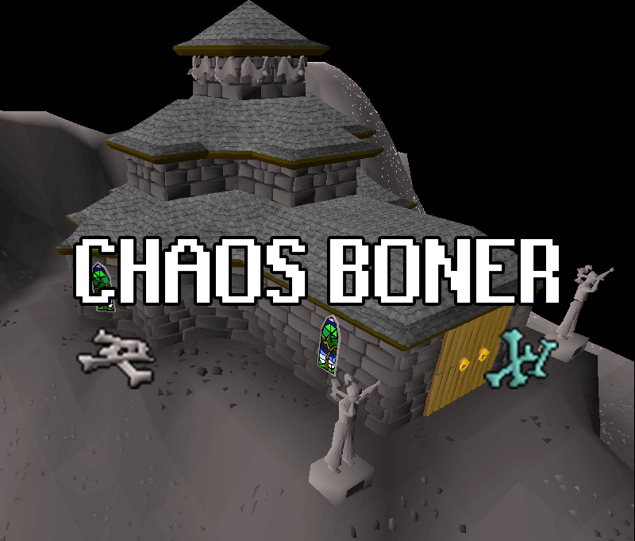

# :church: :skull: Chaos Boner :skull: :church:

## :recycle: Current Process :recycle:
Teleports to Lava Maze using Burning Ammy. Runs to alter and uses bones on alter (click and wait, does not use each bone individually on the alter). Once all bones have been used it will suicide to the Chaos Fanatic. Will then bank using PvP chest in Lumbridge (Will update to other locations eventually). So please ensure your respawn point is set to Lumbridge. Currently only supports Dragon bones.

## :clock9: Future Features :clock9:

- Select which bone you want to use from GUI
- Log from PKer
- Operate in non-PvP worlds
- Multiple suicide methods (steal wine, enchanted symbol)
- Improved GUI
- Breaks

## :bulb: Ideas & Issues :bulb:
If you have any features you'd like implementing or run into any bugs whilst using the Chaos Boner, please feel free to suggest/report them in the issues tab.